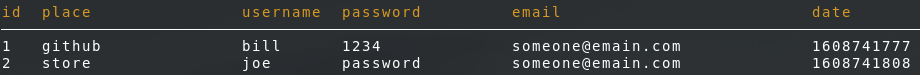

# **PWLOCK**



**pwlock** is a simple yet helpful way to store your passwords in an encrypted
database

**pwlock** can also decrypt the database and let you have access to it though a 
temporary file. This temporary file is removed when pwlock exits.

## Installation

copy the **pwlock** lock file into your bin directory, normally located at
*/usr/bin* or add a location for **pwlock** that you choose to your **PATH** 
eviornment variable

if you bin location is */usr/bin* you can try

```
$ sudo wget https://raw.githubusercontent.com/A-Larsen/pwlock/main/pwlock -O /usr/bin/pwlock
```

and then:

```
$ sudo chmod +x /usr/bin/pwlock
```


## How To Use

### Creating your database

The first thing that you want to do is run **pwlock** without any argument:

```bash
$ pwgen
```

If you do not have a '.passlock.db' file then you will get a prompt like this:

(unless you made this file yourself, it should not exist if you just installed
**pwlock**)

```
no .passlock.db file is found.
do you want to create one (y/n): 
```
if you hit *y* and and then *enter* **pwgen** will create a '.passlock.db' file
in you home directory. This is were all your encrypted passwords go.

Then suppy a password:

```
create password: 
```

This password will need to be entered whenever you want to access you database


### Viewing your database


To view everything in your databse you can simple give **pwlock** no arguments:

(this is assuming you already created a '.passlock.db' file)

```bash
$ pwlock
```
To view old information about a site our place (old passwords or usernames) do:

```bash
$ pwlock old
```

### Storing passwords

The syntax for storing a new password goes like this:

```bash
$ pwlock new {site/place} {email} {username} [GEN]
```
- **site/place**

	This is the website or place this password is used for accessing

- **email**

	Email address of the site or place

- **username**

	Username for the site or place

- **GEN**

	Optional argument that will generate a random password for you

The you will be prompted to enter the password for the database to complete
storing the password:

```
password for database:
```

If you did not supply `pwlock new` with `GEN` then you will have to create a new
password:

```
create password: 
```

Examples: 

```bash
$ pwlock new youtube.com notanemail@site.com joe GEN
```

or

```bash
$ pwlock new youtube.com notanemail@site.com joe 
```

### Getting passwords

To get a password from a place or location you do:

```
$ pwlock getpw {site/place}
```

- **site/place**

	This is the website or place this password is used for accessing

this will copy the password to your clilpboard

### Updating database

To update your password:

```
$ pwlock update {site/place} password [GEN]
```

Examples:

```
$ pwlock update github password 
```

or

```
$ pwlock update github password GEN
```

To update your username:

```
$ pwlock update {site/place} username {new username}
```

Example:

```
$ pwlock update github username notacat 
```

NOTE:

When you update you information for a site/place the old information is sent
to the old table and not lost !

### Acces database via SQLITE

```
$ pwlock sql
```

NOTE:

trying to access your database like this:

```
sqlite3 ~/.passlock.db
```

will not work becuase the database needs to be decrypted first.

## Dependencies

- sqlite3
- pyperclip
- openssl
- getpass
